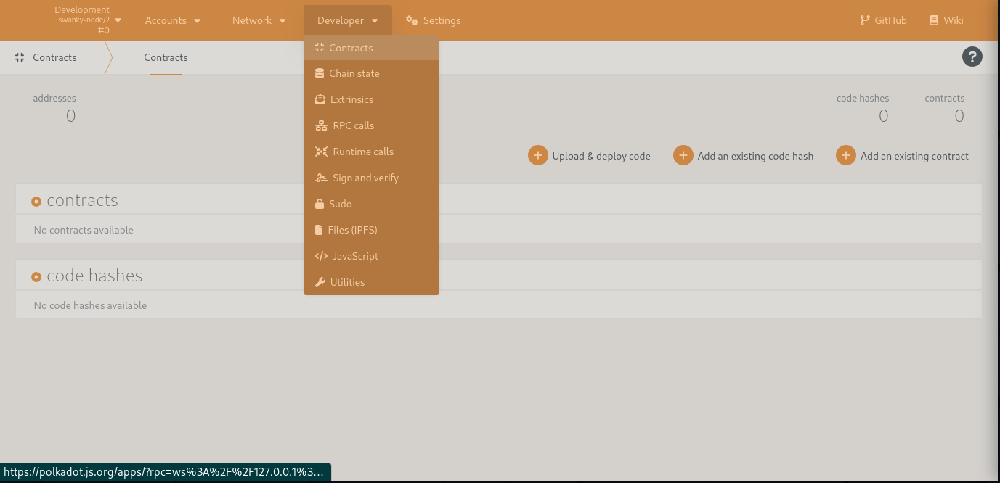
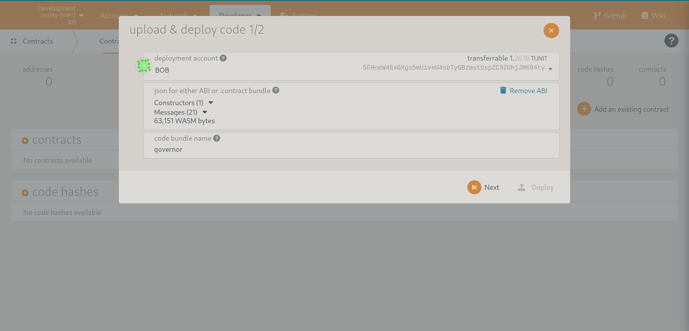
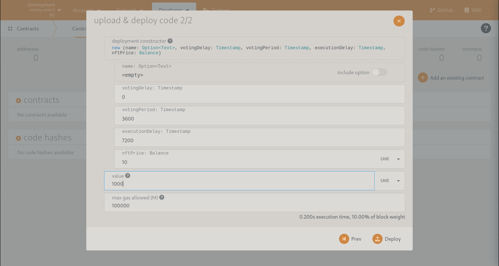
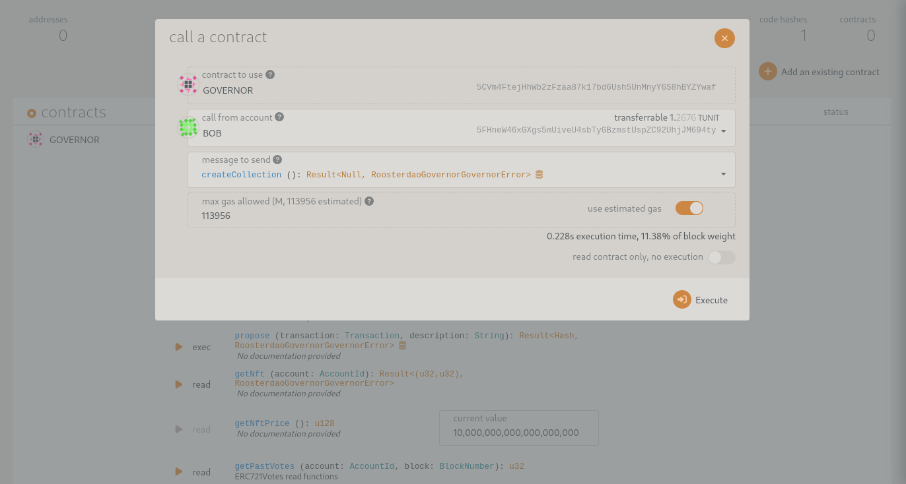
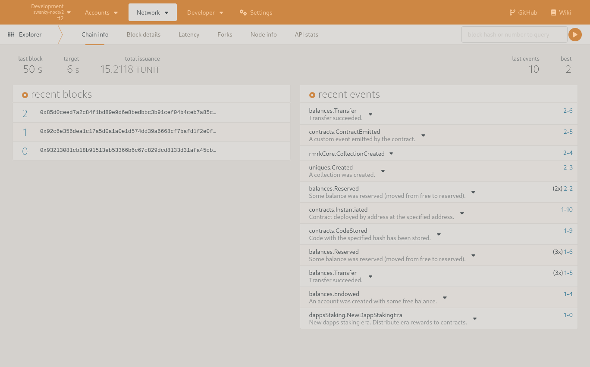

# Manual deploy

To deploy the contract manually open the Developers->Contract section from the polkadot.js interface

Click on 'Upload & deploy code' and select the *./rooster-contracts/contracts/governor/target/ink/governor.contract* you created while compiling the contract:

Click on *Next*. In the next screen a value for the arguments for the contructor can be specified (Note that the unit for Timestamp values is second). The value parameters specifies how many tokens are transferred from the caller to the contract, as the contracts needs resources (eg for minting) this cannot be left zero (or a balance needs to be transfered after instantiation).

If the contract was succesfully instantiated you can call it's methods from the interface. The first method to be called is the *CreateCollection*

After creating the collection you can verify the correct functioning of the contract by checking the events emitted

A next step would be for the current or other accounts to call *BecomeMember*. Note that this is a payable function, the minimum amount was specified during the instantiation of the contract. 

All other functions can now be tested as well. Good Luck!
